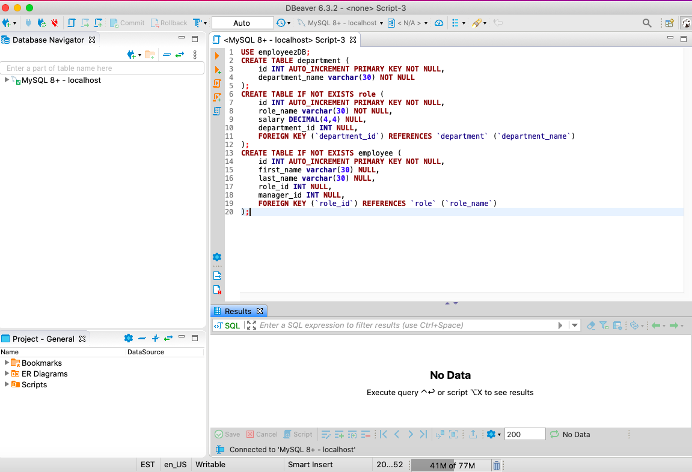
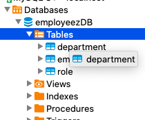
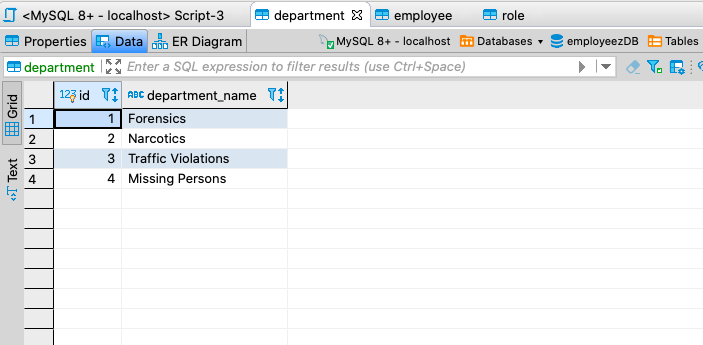
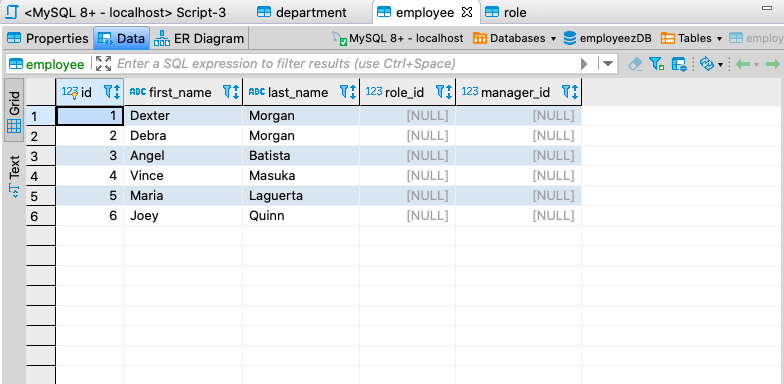
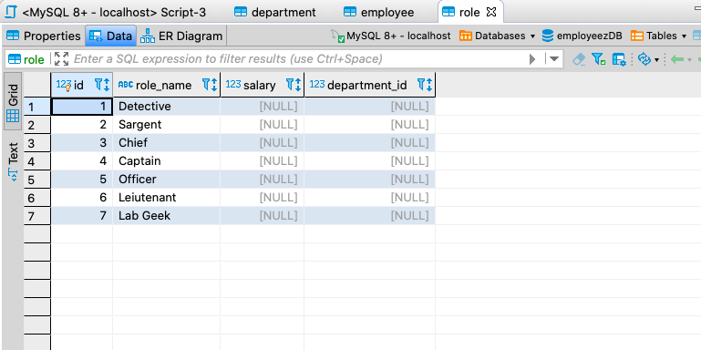
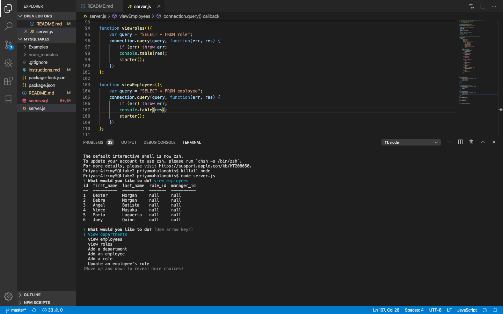

# MySQL Employee Tracker

### GH Pages URL: https://pmahalan.github.io/MySQL_employee_tracker/

My purpose in building this was to create a CLI node application which also referenced a database through MySQL. In addition to creating the CLI interface, I created a database in mySQL and set up the connection to that database. Through the user's execution of the CLI, they are able to view tables from that database. Additionally, I hope to create functionality which will allow the user to update information in the database. 

Additionally, rather than simply console-logging the result of whatever the user chooses to select, I utilized a node package called "console.table". Through the use of this package, the result-data is shown in the terminal in a neat table-like format.

